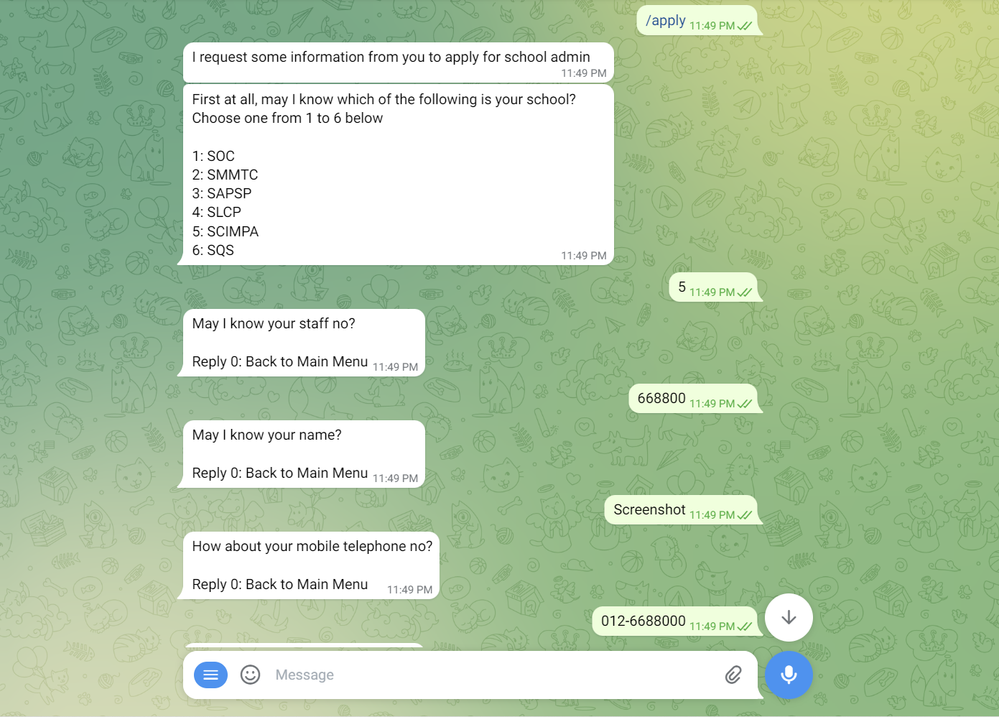
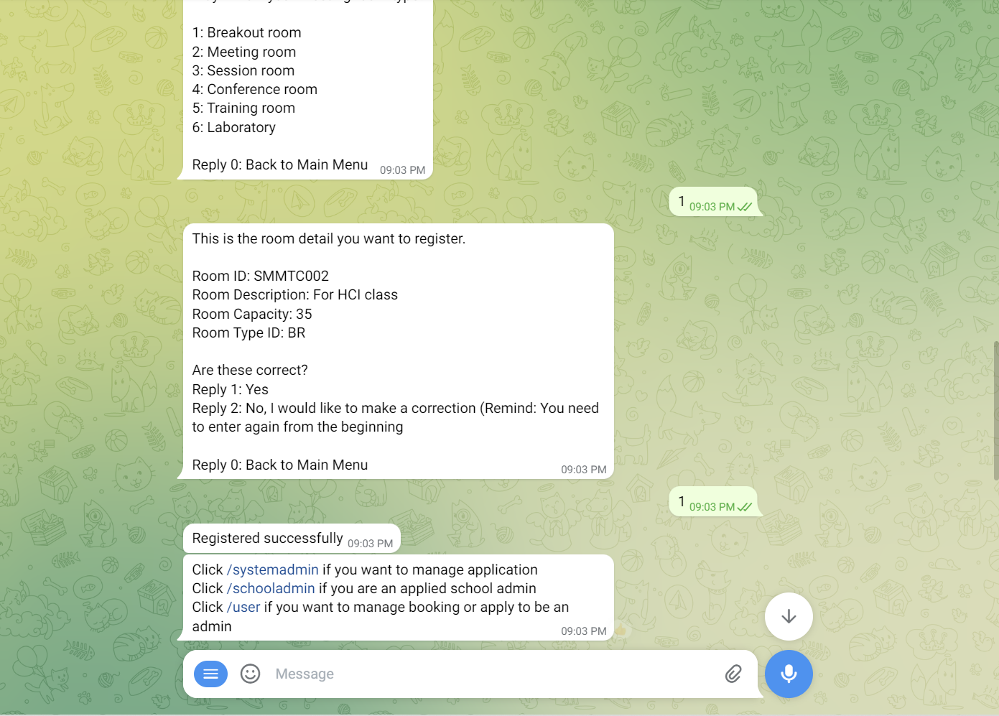
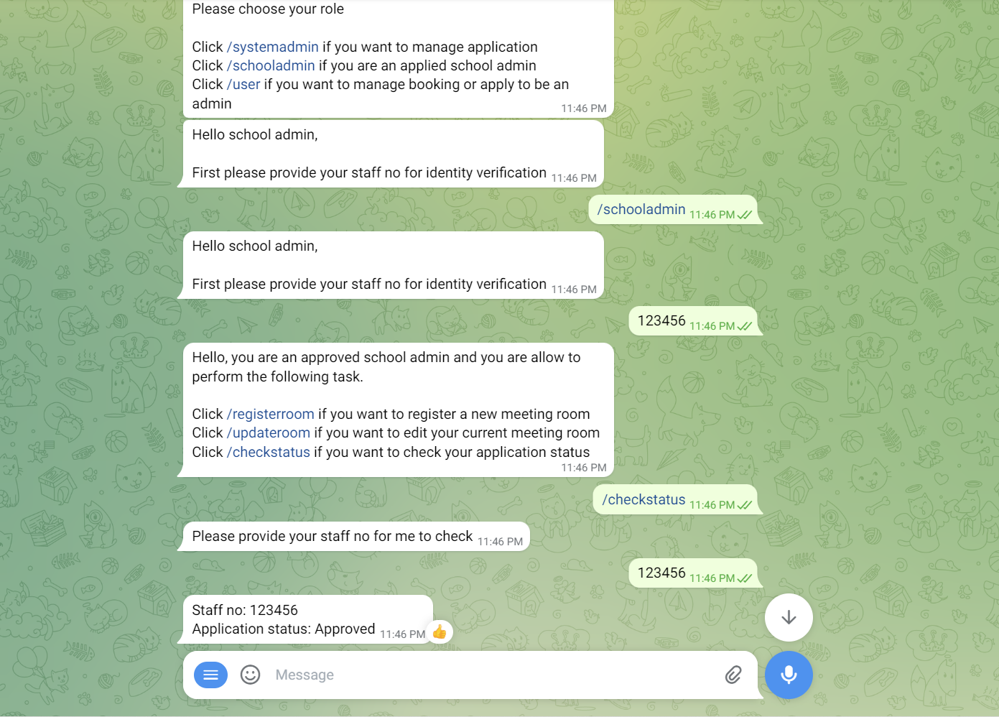
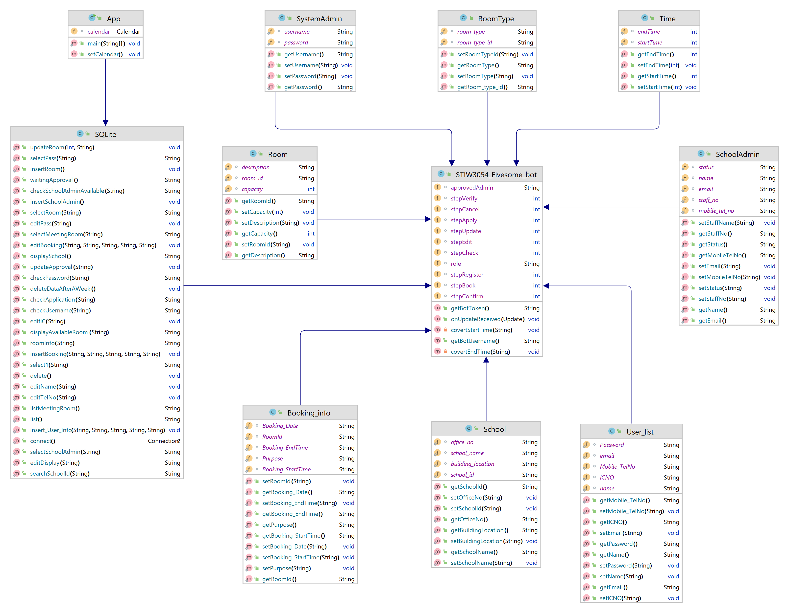

## Group Info:

1.  H'ng Zi Ling
2.  Leong Chun Loon
3.  Chow Sook Qi
4.  Thong Wei Yong
5.  Wong Seow Ting

## Title of your application

Telegram Bot - STIW3054_Fivesome_bot

## Introduction

Telegram bots are small programs that can embed in Telegram chats or public channels and perform a specific function.
They can offer customized keyboards, produce cat memes on demand, or even accept payments and act as a digital
storefront.
The user in this telegram chat box include system admin, school admin and user. Anyone can apply as School Admin subject
to the approval by System_Admin (only one admin can be applied per school). School Admin can register or update the room
info.
The user can booked the room based on their date,start time and end time. A user can update their profile info and
booking info and the user can cancel the booking.

## Flow Diagram of the requirements

## User manual/guideline for testing the system

### User - Anyone can perform ###
- Booking a meeting room
  - Click or type /booking if you want book a meeting room
  - Enter valid date,start time,end time choose the school you want
  - choose the room available you want
  - Enter user info (email,name,telephoneNo,IC,password)
  - check correct or not( If wrong can edit)
  - done
- Cancel the meeting room
  - Click or type /cancel if you want to cancel a meeting room
  - Enter email --> If email exist
  - Enter password -->If password is valid
  - show your booking details and ask user to confirm cancel
- Edit the meeting room
  - Click or type /edit if you want to edit your profile info and booking info
  - Enter email --> If email exist
  - Enter password -->If password is valid
  - show your booking details and ask user what part they want edit
- View list of users
  - Click or type /list if you want to display the list of users
- Apply School Admin
  - Click or type /apply if you are interested in becoming a school admin
  - Select school --> if there are no approved school admin
  - Enter following info
    - About admin - staff no, name, mobile phone no, email
    - About school - office no, building location
    - About room - description, capacity, room type
  - Show the application info and ask user if they want to edit
  - If no problem, applied successfully but not yet approved
      

### School Admin - Need to enter staff no before perform ###

- Register a meeting room
  - Click or type /registerroom if you want to register a new meeting room
  - Enter room id, room description, maximum capacity and room type
  - Show register meeting room details and ask user if they want to edit
  - If no problem, registered successfully
- Update a current meeting room
  - Click or type /updateroom if you want to edit your current meeting room
  - Enter school id
  - Show the meeting room lists under the school
  - Enter room id to select a meeting room that the user want to update info
  - Select and answer the info the user want to update
  - Show update meeting room details and ask user if they want to update
  - If no problem, updated successfully
- Check application status
  - Click or type /checkstatus if you want to check your application status
  - Search the database for staff no
  - Show the status of application
      

### System Admin - Only 1 admin can perform ###

- Click or type /systemadmin if you want to check the user application
- Enter username -> if valid
- Enter password -> if valid
- Show the list of applied school admin
- Enter the staff no selected by the system admin
- Show the candidate info and ask system admin if they want to approve
- if the system admin confirm, school admin status change to approved

## Result/Output (Screenshot of the output)

### User ###
||Feature|Output|
|--|--|:--:|
|<td valign="top">Booking</td>|         |
|<td valign="top">Cancel</td>| |
|<td valign="top">Apply</td>|   |

### School Admin ###
||Feature|Output|
|--|:--:|:--:|
| <td valign="top">Register room</td>|  |
| <td valign="top">Update room</td>| |
| <td valign="top">Check application status</td>||

## Use Case Diagram

## UML Class Diagram

## Database Design

## References

Academy, S. (2022, May 5). _Java telegram bot PRO!_ YouTube. https://www.youtube.com/watch?v=qdrCGjskHKQ

Beazell, A. (2020, July 20). Working with auto-increment IDs & primary keys in SQL.
Retool. https://retool.com/blog/how-to-work-with-auto-incrementing-ids-in-sql/

_Code logic to prevent clash between two reservations._ (2021, October). Stack
Overflow. https://stackoverflow.com/questions/25196411/code-logic-to-prevent-clash-between-two-reservations

Coder, H. (2021, November 9). _Telegram bot in Java._ YouTube. https://www.youtube.com/watch?v=8lBq9jVtD2k&t=296s

CODEuz. (2020, April 5). _Telegram Bot. 07 - InlineKeyboard CallbackQuery._
YouTube. https://www.youtube.com/watch?v=_sGMdQYTflg

Daemon thread in Java. (2021, December 7). GeeksforGeeks. https://www.geeksforgeeks.org/daemon-thread-java/

Deleting Android SQLite rows older than X days. (2012, August 2). Stack
Overflow. https://stackoverflow.com/questions/11771580/deleting-android-sqlite-rows-older-than-x-days

Deploying Java Applications to Heroku from Eclipse or IntelliJ IDEA. (2020). Heroku Dev Center.
https://devcenter.heroku.com/articles/deploying-java-applications-to-heroku-from-eclipse-or-intellij-idea

Deploying Java Applications with the Heroku Maven Plugin. (2022). Heroku Dev Center.
https://devcenter.heroku.com/articles/deploying-java-applications-with-the-heroku-maven-plugin

Deploying Java Apps on Heroku. (2020). Heroku Dev Center.
https://devcenter.heroku.com/articles/deploying-java

Developer, M. (2017). _Lesson 1. Writing your first "echo" bot._
GitBook. https://monsterdeveloper.gitbooks.io/writing-telegram-bots-on-java/content/chapter1.html

Get current date and time in Java. www.javatpoint.com. https://www.javatpoint.com/java-get-current-date

How do I create a daemon which executes TimerTasks? (2020, May). Stack
Overflow. https://stackoverflow.com/questions/61045837/how-do-i-create-a-daemon-which-executes-timertasks

How to check if String contains only alphabets in Java? (n.d.).
TutorialKart. https://www.tutorialkart.com/java/how-to-check-if-string-contains-only-alphabets-in-java/

How to run certain task every day at a particular time using ScheduledExecutorService? (2014, November 10). Stack
Overflow. https://stackoverflow.com/questions/20387881/how-to-run-certain-task-every-day-at-a-particular-time-using-scheduledexecutorse

Isakovinc. (2022). Deploy Java Telegram Bot on Heroku Server. Medium.com.
https://medium.com/@learntodevelop2020/deploy-java-telegram-bot-on-heroku-server-42bfcfc311d3

Java SQLite example - javatpoint. www.javatpoint.com. https://www.javatpoint.com/java-sqlite

Java with SQLite. (n.d.). Javatpoint. https://www.javatpoint.com/java-sqlite

Ordabekov, A. (2021, November 11). _How to create Telegram Bot in Java._
YouTube. https://www.youtube.com/watch?v=XjOnp8TVNSQ

_POM Reference._ (2023, January 18). Apache Maven project. https://maven.apache.org/pom.html

_SQLite Java: Deleting data._ (n.d.). SQLite Tutorial. https://www.sqlitetutorial.net/sqlite-java/delete/

_SQLite Java: Update data._ (n.d.). SQLite Tutorial. https://www.sqlitetutorial.net/sqlite-java/update/

Suvonov, S. (2020, August 30). _Java Telegram Bot. Lesson 3: InlineKeyboardButton._
YouTube. https://www.youtube.com/watch?v=jUiHPVR-IYg

The Procfile. (2022). Heroku Dev Center.
https://devcenter.heroku.com/articles/procfile

Using the Timer and TimerTask Classes._ (n.d.). IIT
Kanpur. https://www.iitk.ac.in/esc101/05Aug/tutorial/essential/threads/timer.html

Vaghela, V. (2020, December 22). _How to create a telegram bot using Java?_
Medium. https://vaghelaviral.medium.com/how-to-create-a-telegram-bot-using-java-5710bed16c0

Java SQLite example - javatpoint. www.javatpoint.com. https://www.javatpoint.com/java-sqlite

SQLite Java: Update data. (2022, August 28). SQLite Tutorial. https://www.sqlitetutorial.net/sqlite-java/update/

SQLite Java: Deleting data. (2022, August 28). SQLite Tutorial. https://www.sqlitetutorial.net/sqlite-java/delete/

Timer (Java SE 10 & JDK 10 ). (2018). Moved. https://docs.oracle.com/javase/10/docs/api/java/util/Timer.html

Timer.schedule api: Why the timer task executes even the first time has passed. (2017, September). Stack
Overflow. https://stackoverflow.com/questions/39511920/timer-schedule-api-why-the-timer-task-executes-even-the-first-time-has-passed

Using the timer and TimerTask classes. IIT
Kanpur. https://www.iitk.ac.in/esc101/05Aug/tutorial/essential/threads/timer.html

Vaghela, V. (2020, December 22). How to create a telegram bot using Java?
Medium. https://vaghelaviral.medium.com/how-to-create-a-telegram-bot-using-java-5710bed16c0

## JavaDoc

Open in browser

https://hngziling.github.io/stiw3054-group-project-fivesome/JavaDoc/my/uum/package-summary.html
